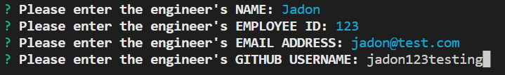

# Team Profile Generator

## Description

Welcome to the team profile generator repo! This project helps to provide a overview of a software engineering team by displaying team members' information. Managers can use this application to access team members' email addresses and GitHub in a single page!

Technologies used to build the application include Inquirer for getting user input, and Jest for running unit tests.

## Getting Started

### Prerequisites

- **Node.js** is required to run the application

### Installation

1. **Clone the repository** ([A guide to cloning repo](https://docs.github.com/en/repositories/creating-and-managing-repositories/cloning-a-repository#cloning-a-repository))  
   `https://github.com/cl-lee/team-profile-generator.git`
2. **Install the Inquirer v8.2.4 package**  
   `npm install inquirer@8.2.4`

## Usage

### Initialisation

1. To begin using the application, open a command-line application and go into the _team-profile-generator_ folder cloned from GitHub

2. Run the application by entering the following line in command-line application:  
   `node index.js`

### Enter Manager's information

- Users will first be prompted to enter the following details for the team manager.
  - Name
  - Employee ID
  - Email address
  - Office number

After entering the team manager's information, users will be taken to the [navigation menu](#navigation-menu).

### Navigation menu

- After completing an employee's information, users will have the following options:
  - [Add an engineer](#add-an-engineer)
  - [Add an intern](#add-an-intern)
  - [Finish building the team](#finish-building-the-team)

### Add an engineer

- When the users select "Add an engineer", they will be prompted to enter the following details for the engineer.  
  - Name
  - Employee ID
  - Email address
  - GitHub username

After entering the engineer's information, users will be taken back to the [navigation menu](#navigation-menu).

### Add an intern

- When the users select "Add an intern", they will be prompted to enter the following details for the intern.  
  - Name
  - Employee ID
  - Email address
  - School name

After entering the intern's information, users will be taken back to the [navigation menu](#navigation-menu).

### Finish building the team

When a user selects "Finish building the team" in the navigation menu, it will generate the output html file and stop running.

The file can be found as "team.html" in the app's output folder.  

## Contact

Project Link: https://github.com/cl-lee/team-profile-generator
